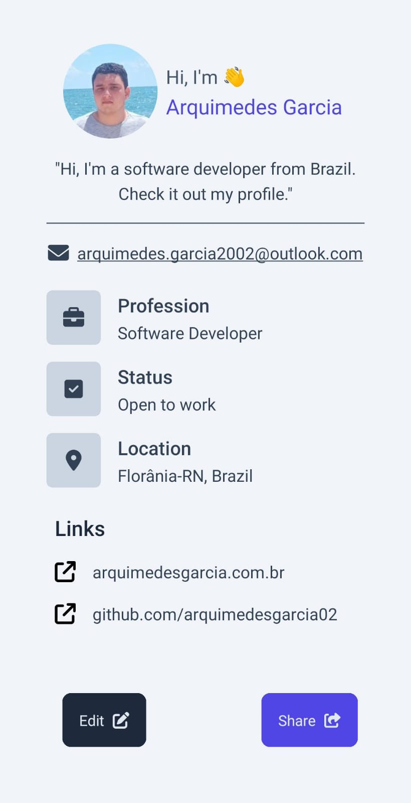

# MyCardApp 

**MyCardApp** is a React Native application built with Expo that allows users to create and share digital business cards. It's designed to help professionals easily share their contact information and showcase their work.

This app is currently in Beta.

## Running locally

Follow these steps to get the project up and running locally.

### Install dependencies

        npm install

Install dependencies with Expo:

        npx expo install

### Run with

        npx expo start

## Install and use in your phone

[Get the app in the repository releases area](https://github.com/arquimedesgarcia02/MyCardApp/releases)

[Get the app in the Google Play Store (soon)]()

The app is available only in Android for now.

## Preview

## License

[MIT License](LICENSE)
